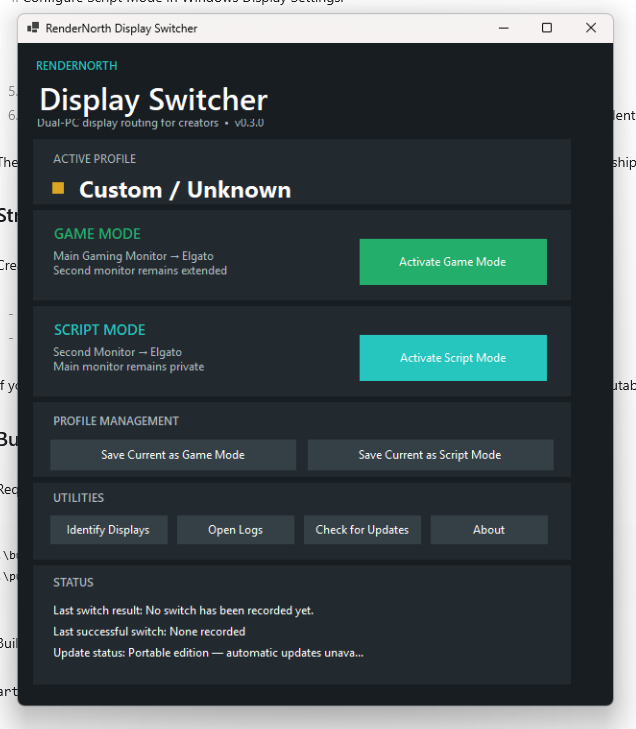
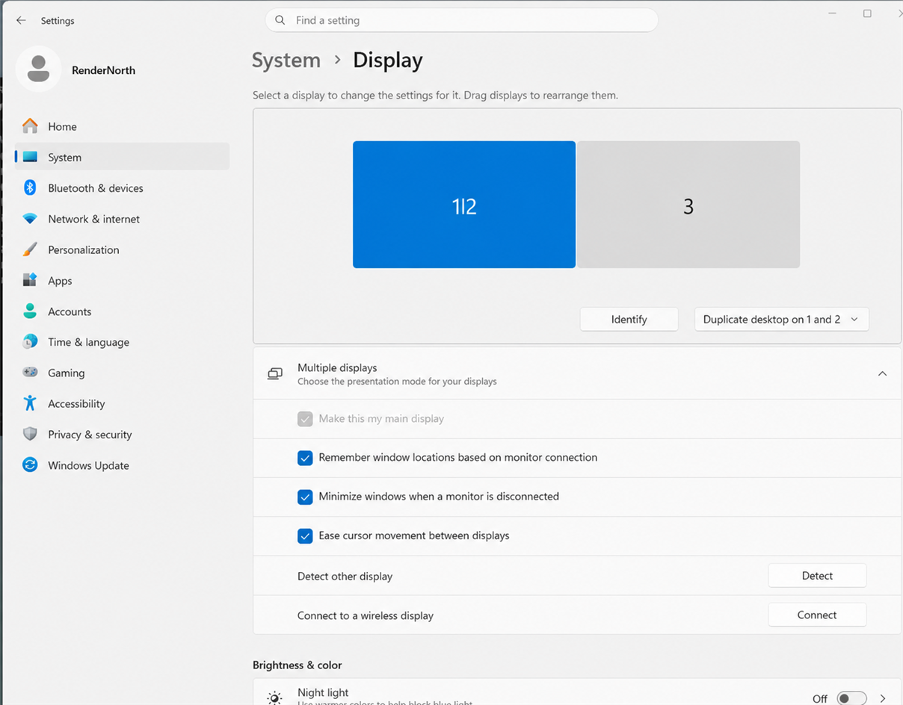
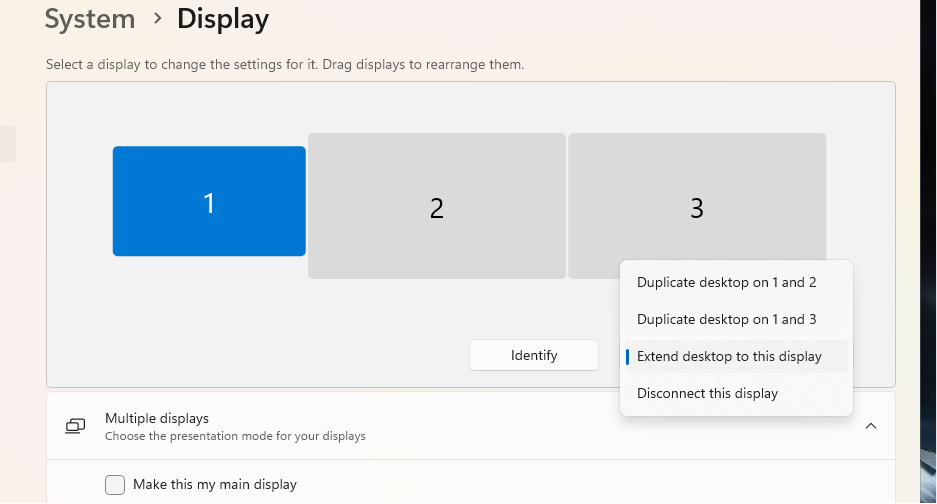

# RenderNorth Display Switcher

**Fast, reliable Windows display-profile switching for dual-PC streaming setups.**

RenderNorth Display Switcher saves two known-good Windows display configurations and restores either one from a small desktop app, a silent command, or dedicated Elgato Stream Deck launchers. It uses the native Windows display-configuration APIs and does not require OBS, Streamlabs, or DisplayFusion.

> **Platform:** Windows 11 x64<br>
> **Release:** v0.3.0<br>
> **Brand:** RenderNorth



## The problem

A dual-PC streaming setup may need the capture device to mirror different physical monitors at different times. Rebuilding those clone and extended-desktop relationships in Windows Settings during a stream is slow and error-prone. Windows display numbers can also change, making scripts that assume fixed numbers unreliable.

RenderNorth Display Switcher lets Windows create each working layout once, captures the exact native configuration, and restores it later using stable monitor device identities.

## Features

- Saves exact **Game Mode** and **Script Mode** display layouts.
- Restores clone relationships, source positions, resolutions, and refresh-rate data through `QueryDisplayConfig` and `SetDisplayConfig`.
- Identifies monitors by device path instead of assuming Windows display numbers remain fixed.
- Keeps the current layout as a rollback configuration if activation fails.
- Verifies the resulting source-to-target topology after each switch.
- Provides dedicated `RenderNorthGameMode.exe` and `RenderNorthScriptMode.exe` launchers for Stream Deck.
- Runs command-line and launcher activation silently with meaningful exit codes.
- Logs actions and errors locally.
- Detects whether the current topology matches Game Mode, Script Mode, or neither.
- Includes an About dialog with RenderNorth project links and version information.
- Requires no installer and collects no telemetry.

## Screenshots

### Application


### About RenderNorth Display Switcher


### Example Windows layouts

The numbers shown by Windows are examples only; your numbering may differ.

| Game Mode example | Script Mode setup example |
|---|---|
|  |  |

## Installation

1. Download the v0.3.0 installer from the GitHub release (recommended), or the portable ZIP.
2. Right-click the ZIP, choose **Extract All**, and keep the extracted files together.
3. Run `RenderNorthDisplaySwitcher.exe`.
4. If Windows SmartScreen appears, verify that the file came from the official RenderNorth release before choosing **More info > Run anyway**.

The **installed edition** is recommended and supports automatic updates through official RenderNorth GitHub Releases. The **portable ZIP** includes required runtime files and does not self-update; download a newer portable ZIP manually. Neither edition requires a separate .NET installation.

## Automatic updates

The installed edition checks GitHub Releases after the normal GUI opens without blocking startup. It never checks, downloads, installs, or displays update UI during `--game`, `--script`, or Stream Deck switching. Use **Utilities > Check for Updates** for a manual check. Updates are optional: review the available version and notes, choose **Download and Install**, then confirm restart. Failures leave the application usable and are reported non-blockingly in Status and the local log.

Profiles and logs are created beside the application, so install it in a folder where your Windows account can write files. Do not run it directly from inside the ZIP.

## Saving profiles

Connect every monitor and capture device before saving either profile.

### Game Mode

1. Open **Settings > System > Display**.
2. Configure the main gaming monitor to duplicate to the capture output.
3. Leave the secondary physical monitor extended.
4. Confirm the main gaming monitor is primary.
5. Open RenderNorth Display Switcher and select **Save Current Layout as Game Mode**.

### Script Mode

1. Return to **Settings > System > Display**.
2. Leave the main gaming monitor extended and private.
3. Duplicate the secondary physical monitor to the capture output.
4. Confirm the main gaming monitor is still primary.
5. Select **Save Current Layout as Script Mode**.

Test both **Activate** buttons before relying on the profiles during a stream. Profiles are machine-specific and depend on the saved monitor device identities.

## Using with Elgato Stream Deck

No command-line argument support is required in Stream Deck.

1. Open the Stream Deck application.
2. Add a **System > Open** action for Game Mode.
3. Select `RenderNorthGameMode.exe` as its App/File and label the button **Game Mode**.
4. Add another **System > Open** action.
5. Select `RenderNorthScriptMode.exe` and label the button **Script Mode**.
6. Test both buttons while watching the capture preview.

Keep these files in the same folder:

- `RenderNorthDisplaySwitcher.exe`
- `RenderNorthGameMode.exe`
- `RenderNorthScriptMode.exe`

### Silent launcher executables

The launchers locate the main application relative to themselves, wait for switching to finish, return its exit code, and close. Successful switches and display-engine failures show no window, console, toast, splash screen, or popup. Results are written to the local `logs` folder.

The equivalent direct commands are:

```powershell
RenderNorthDisplaySwitcher.exe --game
RenderNorthDisplaySwitcher.exe --script
```

Starting `RenderNorthDisplaySwitcher.exe` without arguments opens the normal graphical interface.

## Building from source

Requirements:

- Windows 11 x64
- [.NET 8 SDK](https://dotnet.microsoft.com/download/dotnet/8.0)
- PowerShell 5.1 or later
- Git, if you want source-control metadata

From the repository root:

```powershell
Set-ExecutionPolicy -Scope Process Bypass
.\build.ps1
```

Build output is written to `artifacts\build`.

## Publishing

Create the application publish output:

```powershell
.\publish.ps1
```

Create the v0.3.0 portable ZIP plus Velopack installer/update assets:

```powershell
.\release.ps1
```

Generated outputs are placed under `artifacts` and are intentionally excluded from Git.

## Troubleshooting

### A profile has not been saved

Open the normal application, configure the layout in Windows Settings, and use the matching **Save Current Layout** button.

### A required display is missing

Reconnect the monitor or capture device using the expected port. The utility refuses to apply a profile if one of its saved monitor device paths is absent.

### The switch fails or produces a custom layout

Open the application and check the status area. Review `logs\display-switcher-YYYYMMDD.log`. If rollback also failed, press `Win+P` or restore the layout through Windows Display Settings.

### Stream Deck does nothing

Confirm the complete extracted release folder—including its runtime files—remains together. Open the daily log file for the exact failure.

### Windows display numbers changed

This is normally harmless because the utility validates monitor device paths, not only the numbers displayed in Settings. Re-save both profiles after changing a GPU, cable path, dock, capture device, or monitor.

## Known limitations

- Windows 11 x64 only.
- Exactly two named profiles: Game Mode and Script Mode.
- Profiles are tied to the machine and connected monitor identities on which they were saved.
- Portable builds do not self-update. The initial v0.3.0 installer is not code-signed unless a signing certificate is supplied to the release pipeline.
- Windows and GPU drivers may adjust unsupported timings when applying a saved layout.
- Display switching must be tested on each target hardware setup before production use.

## FAQ

### Does this control OBS, Streamlabs, or the Elgato software?

No. It changes the Windows display topology. Your capture software continues to receive whatever signal Windows sends to the capture output.

### Does it change my resolution or refresh rate?

It restores the exact saved mode arrays and preserves timings whenever Windows and the display driver allow. Windows may make a necessary supported-mode adjustment.

### Where are profiles and logs stored?

The application creates `profiles` and `logs` folders beside its executable. Saved profile JSON can contain monitor device identifiers and the local machine name; do not publish those generated files.

### Is administrator access required?

No. The application uses the normal user-level Windows display configuration APIs.

### Can I create more profiles?

Not in v0.3.0. The release intentionally focuses on one Game Mode and one Script Mode.

## Privacy

RenderNorth Display Switcher has no analytics, telemetry, advertising, accounts, or network features. Configuration and log data remain local beside the executable. The program does not transmit monitor identifiers or usage information.

## Contributing and security

See [CONTRIBUTING.md](CONTRIBUTING.md) for development guidance and [SECURITY.md](SECURITY.md) for private vulnerability reporting guidance. Architectural rationale is recorded in [DECISIONS.md](DECISIONS.md).

## License

Copyright © 2026 RenderNorth. Released under the [MIT License](LICENSE).

---

**RenderNorth** — practical tools for reliable production workflows.
