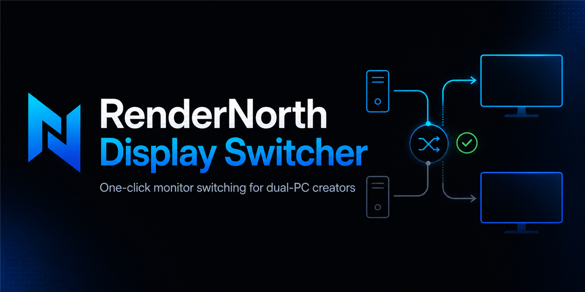
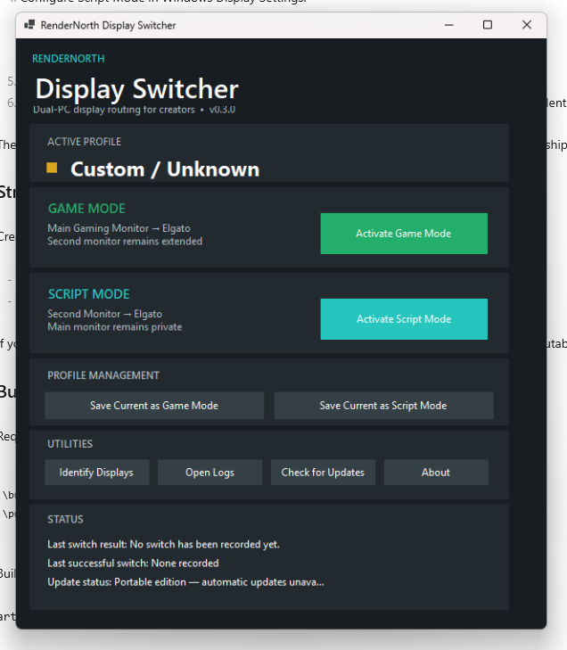
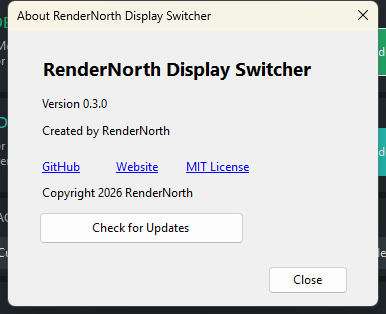
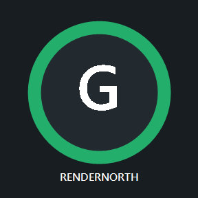
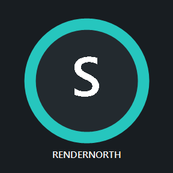

# RenderNorth Display Switcher


[](https://dotnet.microsoft.com/download/dotnet/8.0)
[](LICENSE)
[](https://github.com/Maxdelta/rendernorth-display-switcher/releases/latest)
[](https://github.com/Maxdelta/rendernorth-display-switcher/releases)

## DOWNLOAD FOR WINDOWS

### For most users

Download and run **RenderNorth-Display-Switcher-Setup-v0.3.2.exe** from the [latest GitHub Release](https://github.com/Maxdelta/rendernorth-display-switcher/releases/latest).

- **Setup edition — recommended:** installs the GUI, adds Windows shortcuts, and supports optional in-app updates.
- **Portable - Manual Updates:** intended for advanced/testing use; extract the complete ZIP and replace it manually when updating.
- `.nupkg`, `RELEASES`, and `releases.win.json` are updater support files, not normal user downloads.

**One-click display switching for dual-PC streamers using Elgato capture cards.**

RenderNorth Display Switcher instantly restores saved Windows display layouts, so you do not have to open Windows Display Settings during a stream. It was built for dual-PC creators who need to change which monitor is mirrored to an Elgato capture card while keeping another display private.

It runs independently of OBS, Streamlabs, and DisplayFusion on the gaming PC. The installed edition supports optional in-app updates; the portable edition is replaced manually when a new version is released.





*The main window shows the detected display profile, prominent Game and Script controls, profile management, utilities, and switch/update status.*

## Quick Start

1. Download and run the recommended Setup EXE above.
2. Open **RenderNorth Display Switcher** from the Start menu.
3. [Configure and save Game Mode](#saving-profiles).
4. Configure and save Script Mode.
5. [Add the stable installed shortcuts to Stream Deck](#using-with-elgato-stream-deck).
6. Press either button to switch the Elgato routing.

## Why I Built This

I use a dual-PC streaming setup. Sometimes I want viewers to see the game on my main gaming monitor. Other times I want to read a script directly beneath my camera while viewers continue seeing gameplay, files, code, or browser content from my second monitor.

Windows makes changing which display is duplicated to the capture card slow and awkward during a live stream. I built RenderNorth Display Switcher so I could change that routing with one Stream Deck button.

## Who Is This For?

- Dual-PC streamers
- Elgato HD60 X users and users of other HDMI capture cards that appear as Windows display outputs
- Elgato Stream Deck users
- Developers demonstrating software
- Presenters using private notes
- Creators who need one display to remain private

The original hardware verification used an Elgato HD60 X. Other HDMI capture devices may work when Windows recognizes them as display outputs, but they have not all been individually tested.

## The Two Display Layouts

Windows treats monitors and capture-card outputs as a display topology: a map of which screens are extended and which are duplicated. RenderNorth Display Switcher lets you configure each layout once in Windows, then saves and restores the exact working topology. It identifies monitors using stable Windows device paths instead of trusting display numbers that may later change.

### Game Mode

- The main gaming monitor is duplicated to the Elgato.
- The game remains directly in front of the streamer.
- The second monitor remains extended.

### Script Mode

- The main monitor remains private for a script beneath the camera.
- The second monitor is duplicated to the Elgato.
- Viewers see the second monitor through the streaming PC.
- The private script display is not sent to the streaming computer.

## Features

- Saves exact **Game Mode** and **Script Mode** layouts.
- Restores clone relationships, positions, resolutions, and refresh-rate data using native `QueryDisplayConfig` and `SetDisplayConfig` APIs.
- Uses monitor device paths instead of assuming Windows display numbers remain fixed.
- Captures a rollback configuration before switching and restores it when possible after failure.
- Verifies the resulting source-to-monitor topology.
- Provides silent Game and Script launcher executables for Stream Deck.
- Detects whether the active layout is Game Mode, Script Mode, or Custom / Unknown.
- Writes local action and error logs.
- Requires no OBS, Streamlabs, or DisplayFusion integration.
- Collects no analytics or telemetry.

## Screenshots and Stream Deck Icons

### Application and About

| Main application | About dialog |
|---|---|
|  |  |

### Example Windows layouts

The numbers assigned by Windows are examples only; yours may differ.

| Game Mode example | Script Mode setup example |
|---|---|
|  |  |

### Included Stream Deck icons

| Game Mode | Script Mode |
|---|---|
|  |  |

## Installation and Updates

For most users, download and run the Setup EXE from the [GitHub Releases page](https://github.com/Maxdelta/rendernorth-display-switcher/releases/latest). The one-click installer creates **RenderNorth Display Switcher** shortcuts in the Start menu and on the desktop, then opens the GUI without command-line arguments.

| Installed edition | Portable edition |
|---|---|
| Recommended for normal users | Useful for testing or temporary use |
| Includes a Windows installer | No installation required |
| Supports **Check for Updates** | Does not support automatic updates |
| Supports optional download and restart-to-install | Replace the extracted folder manually with a newer portable release |

Updates are never forced. The installed edition checks after the normal GUI starts without blocking it. Review an available version and release notes, choose **Download and Install**, and confirm the restart when convenient. Update activity never runs during `--game`, `--script`, or Stream Deck switching.

The initial public binaries are not Authenticode-signed, so Windows SmartScreen may appear. Verify that the download came from the official [Maxdelta repository](https://github.com/Maxdelta/rendernorth-display-switcher) before running it.

Installed profiles and logs are stored in the stable application root outside Velopack's replaceable `current` directory, so they survive updates. Portable profiles and logs remain beside the application. Do not run the portable edition directly from inside its ZIP.

See the [First Run Guide](docs/FIRST_RUN.md) for the complete initial setup sequence.

## Saving Profiles

Connect every monitor and capture device before saving either profile.

### Save Game Mode

1. Open **Settings > System > Display**.
2. Duplicate the main gaming monitor to the capture output.
3. Leave the second physical monitor extended.
4. Confirm the main gaming monitor is primary.
5. Open RenderNorth Display Switcher and select **Save Current Layout as Game Mode**.

### Save Script Mode

1. Return to **Settings > System > Display**.
2. Leave the main monitor extended and private.
3. Duplicate the second monitor to the capture output.
4. Confirm the main gaming monitor remains primary.
5. Select **Save Current Layout as Script Mode**.

Test both **Activate** buttons while watching the capture preview before using the profiles live. Profiles are machine-specific and depend on the connected monitor identities.

## Using with Elgato Stream Deck

The Stream Deck must be connected to the gaming PC running the utility.

1. In Stream Deck, add **System → Open Application** for Game Mode.
2. Browse to the Windows Start-menu shortcut **RenderNorth Display Switcher - Game Mode** and label the button **Game Mode**. Its stable location is `%APPDATA%\Microsoft\Windows\Start Menu\Programs`.
3. Add a second **System → Open Application** action.
4. Select the Start-menu shortcut **RenderNorth Display Switcher - Script Mode** and label it **Script Mode**.
5. Optionally use the included icons from `assets/stream-deck`.

These installed shortcuts target Velopack's stable, non-versioned application launcher and survive updates. They switch profiles silently: no popup, console window, splash screen, or main application window appears. The Elgato feed may briefly go black while Windows renegotiates the display signal.

The installed package also keeps `RenderNorthGameMode.exe` and `RenderNorthScriptMode.exe` alongside the main application. Portable users should point Stream Deck directly to those executables and keep the complete extracted folder together.

Equivalent direct commands are:

```powershell
RenderNorthDisplaySwitcher.exe --game
RenderNorthDisplaySwitcher.exe --script
```

Starting `RenderNorthDisplaySwitcher.exe` without arguments opens the normal interface.

## Building from Source

Requirements:

- Windows 11 x64
- [.NET 8 SDK](https://dotnet.microsoft.com/download/dotnet/8.0)
- PowerShell 5.1 or later

```powershell
Set-ExecutionPolicy -Scope Process Bypass
.\build.ps1
```

Build output is written to `artifacts\build`.

## Publishing

```powershell
.\publish.ps1
.\release.ps1 -Version 0.3.2
```

The release script creates the Velopack installer/update assets and portable ZIP under `artifacts`. See [docs/RELEASING.md](docs/RELEASING.md) for the complete release workflow.

## Troubleshooting

### A profile has not been saved

Configure the layout in Windows Display Settings, open the normal application, and use the matching **Save Current Layout** button.

### A required display is missing

Reconnect the monitor or capture device using its expected GPU port. The utility refuses to apply a profile when a saved monitor device path is absent.

### The switch fails or shows Custom / Unknown

Review the Status area and `logs\display-switcher-YYYYMMDD.log`. If rollback also fails, press `Win+P` or restore the layout through Windows Display Settings.

### Stream Deck does nothing

Confirm the Stream Deck is attached to the gaming PC and that the complete installed or portable application folder remains together. Review the daily log for the exact error.

### Windows display numbers changed

This is normally harmless because the utility validates monitor device paths rather than relying only on display numbers. Re-save both profiles after changing a GPU, dock, cable path, monitor, or capture device.

### Update checking fails

The current application remains usable. Check the internet connection and the [public release page](https://github.com/Maxdelta/rendernorth-display-switcher/releases), then review the local log. Portable builds intentionally report that automatic updates are unavailable.

## Known Limitations

- Windows 11 x64 only.
- Exactly two named profiles in v0.3.2.
- Profiles are tied to the machine and monitor identities on which they were saved.
- Other capture-card models have not all been tested.
- Portable builds do not self-update.
- Current public binaries are not Authenticode-signed.
- Windows and GPU drivers may adjust unsupported display timings.

## FAQ

### Does this control OBS, Streamlabs, or Elgato capture software?

No. It changes the Windows display topology. Capture software continues to receive the signal sent to the capture output.

### Does it change resolution or refresh rate?

It restores saved mode arrays and preserves timings whenever Windows and the display driver allow. Windows may make a necessary supported-mode adjustment.

### Where are profiles and logs stored?

The application creates `profiles` and `logs` folders beside its executable. Profile JSON can contain the local machine name and monitor device identifiers; do not publish those generated files.

### Is administrator access required?

No. The application uses normal user-level Windows display configuration APIs.

## Roadmap

Possible future directions—not promised release commitments—include:

- More than two saved profiles
- Window placement and application launching
- Audio-device profiles
- Deeper Stream Deck integration
- Optional creator workspace modes

## Privacy and Security

RenderNorth Display Switcher has no analytics, telemetry, advertising, or accounts. Profiles and logs remain local. The installed edition contacts the configured public GitHub Releases repository over HTTPS only for optional update metadata and Velopack packages. No GitHub credential is stored in the application.

See [SECURITY.md](SECURITY.md) for vulnerability reporting and update-security details. See [CONTRIBUTING.md](CONTRIBUTING.md) for development guidance.

## RenderNorth Ecosystem

RenderNorth Display Switcher is the first public RenderNorth desktop application and the reference implementation for future creator-focused Windows utilities. Its installer, optional updater, release automation, local logging, documentation, and silent launcher pattern form the baseline documented in the [RenderNorth Desktop Product Standard](docs/DESKTOP_PRODUCT_STANDARD.md).

Website-ready product copy is maintained in [docs/PRODUCT_PAGE.md](docs/PRODUCT_PAGE.md). Reusable launch copy is available in [docs/MARKETING.md](docs/MARKETING.md).

## License

Released under the [MIT License](LICENSE).

---

**Part of the RenderNorth software ecosystem.**

[Website](https://rendernorth.com) · [GitHub](https://github.com/Maxdelta)

Copyright 2026 RenderNorth<br>
MIT License
